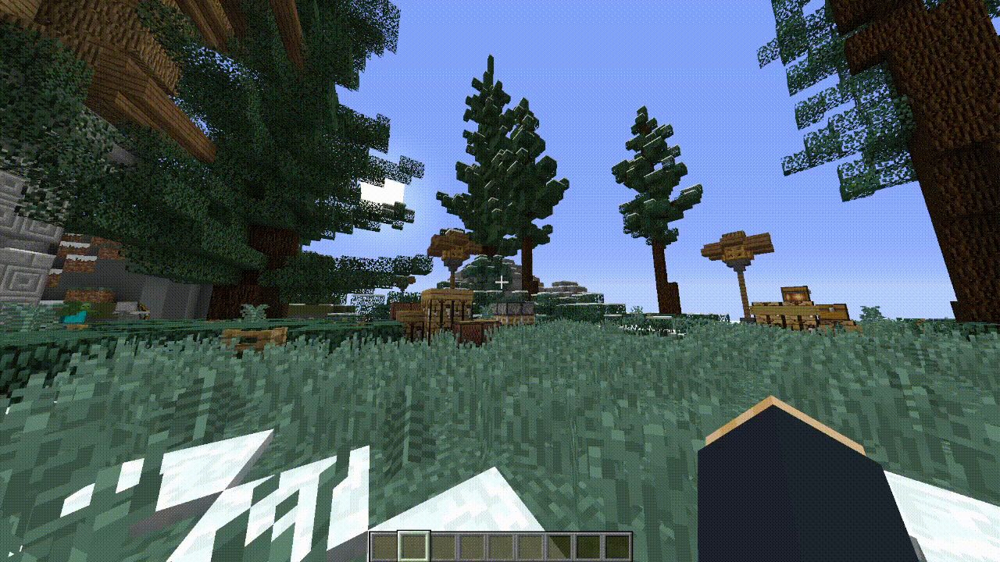

# Administration
## Création Titre
Pour créer un tag, utilisez la commande suivante : `/tag create LE_NOM_DE_VOTRE_TAG`

## Gestion Titre

## Lister les titres d'un joueur

## Donner un titre à un joueur

## Retirer un titre à un joueur